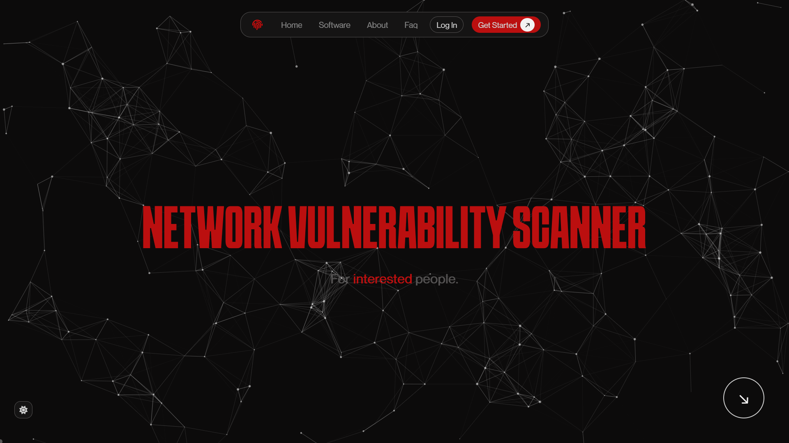

### 📄 `nvs-core` – README
## Preview


<p align="center">
  
</p>

# 🧠 nvs Core – Network Vulnerability Scanner Engine

> `nvs-core` is the backend engine of the **NVS (Network Vulnerability Scanner)** project. It contains CLI scripts and scanning logic to detect device services, open ports, and potential WiFi vulnerabilities. Designed to be used standalone or through the [`nvs-web`](https://github.com/undertry/nvs-web) interface.


---

## 🧰 What It Does

- 🔍 Scan for active WiFi networks
- 🧪 Check for open ports and known vulnerabilities
- ⚙️ Perform device service fingerprinting
- 📡 Prepare data for web visualization via API (used by `nvs-web`)

---

## ⚙️ Tech Stack

| Category         | Technology         |
|------------------|--------------------|
| Language         | Python 3.8+        |
| Networking       | `nmap`, `nmcli`    |
| API (optional)   | Flask (minimal API bridge) |
| Execution Type   | CLI / Script-based |

---

## 🛠️ Requirements

- Python 3.8+
- `nmap` installed
- Linux or Unix-like system (recommended)
- (Optional) Flask for API mode

---

## 🚀 Getting Started

### 1. Clone the Repository

```bash
git clone https://github.com/undertry/nvs-core.git
cd nvs-core
```

### 2. (Optional) Create a Virtual Environment

```bash
python3 -m venv venv
source venv/bin/activate
```

### 3. Install Dependencies

```bash
pip install -r requirements.txt
```

### 4. Run a Scan Manually

```bash
python3 scanner.py
```

Or use specific tools:

```bash
bash scripts/scan_wifi.sh
bash scripts/scan_ports.sh
```

---

## 🌐 Run as API (for `nvs-web` integration)

```bash
python3 api_server.py
```

The API will be available at `http://localhost:5000`.

---

## 📁 Project Structure

```
nvs-core/
├── scripts/           → Shell scripts for network scanning
├── scanner.py         → Main Python scanner script
├── api_server.py      → Optional Flask API
├── requirements.txt   → Python dependencies
└── README.md          → You are here
```

---

## 🔗 Related Projects

- [nvs-web](https://github.com/undertry/nvs-web) – Web interface that connects to `nvs-core` to visualize scans and control actions remotely.

---

## 👨‍💻 Author

- **CLI & Backend:** [@undertry (Tiago Comba)](https://github.com/undertry)

---

## 📄 License

This project is licensed under the **GPL-2.0 License**. See the [LICENSE](LICENSE) file for details.

---

> “Scan smart. Stay secure.” 🔒

